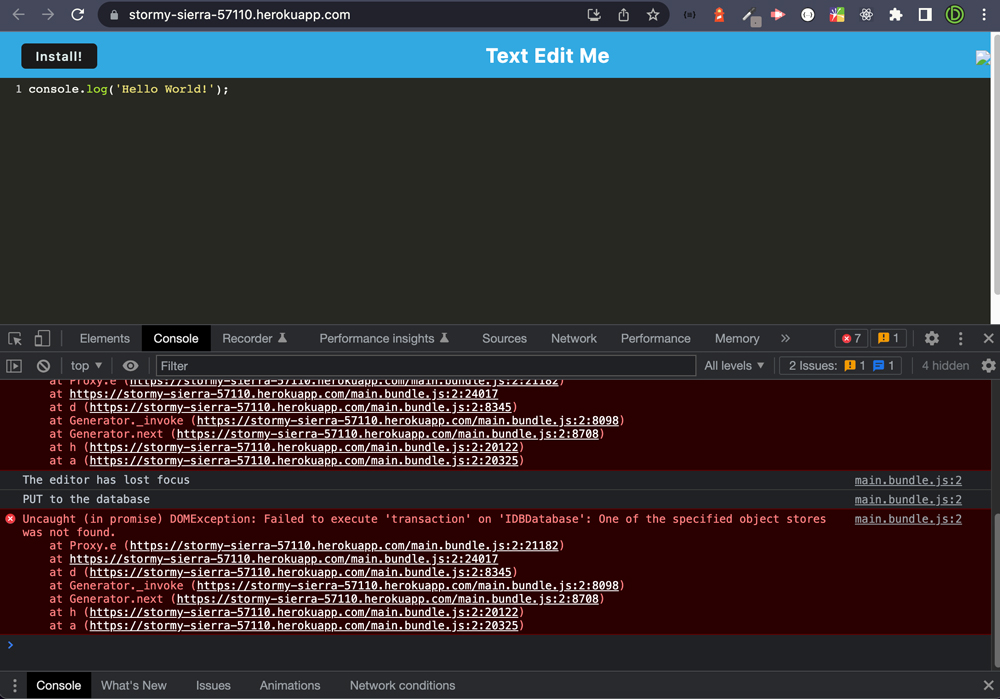

# text-edit-me
## A fun text edit app that can be accessed anywhere!

## Purpose:

An easy to use text editor that stores snippets of code to the users computer. This project is incomplete and has issues that could not be resolved. See screenshot below.

## Heroku Deployed Website Link:

## https://stormy-sierra-57110.herokuapp.com/

 

## **Table of contents:**

- [Installation](#installation)
- [Start](#start)
- [Usage](#usage)
- [Contribute](#contribute)
- [Questions](#questions)

 

     

 

 

## This Full-stack App Was Created Using:

- JavaScript
- NodeJS
- Express
- Concurrently
- Babel
- Webpack
- Heroku
- GitHub

 

## Installation:

### To install all packages use this command in the the terminal:

`npm i`

 

## Start:

### To start use this command in the the terminal: 

`npm start`

 

## Usage:

### The respository can be cloned and placed in a folder remotely.

 

## Contribute:

### Please contact me regarding contributing to this repository. All additions must be approved.

 

## Questions?

### If you have any questions here's how to contact me:

- Username: DronetDevDesign
- Repository: https://github.com/DronetDevDesign
- Email: ron@DronetDevDesign.com

